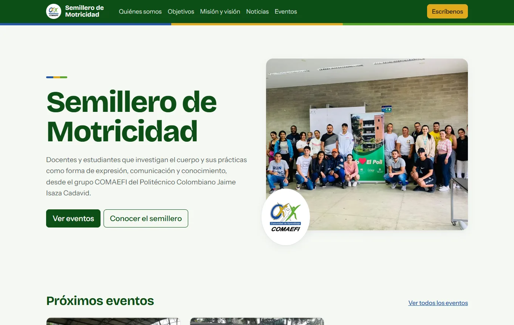
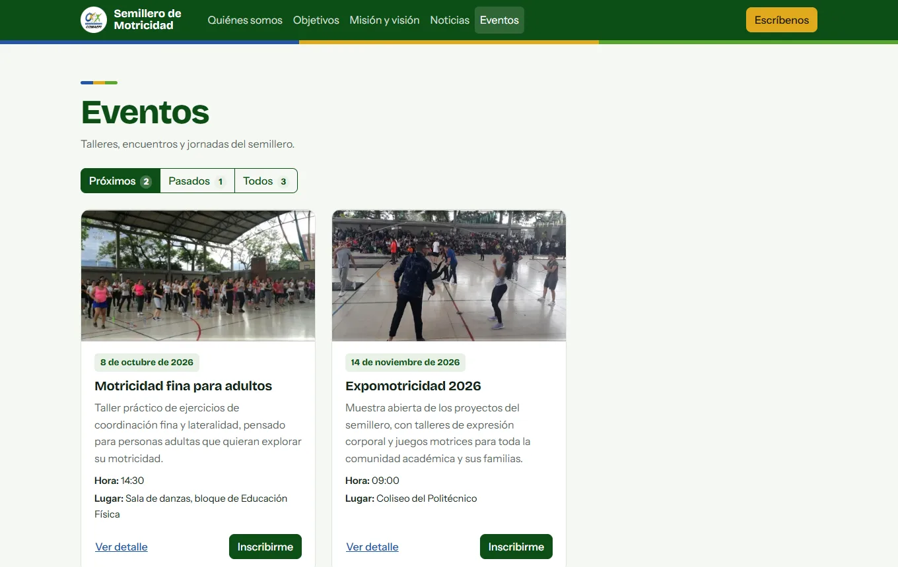

# Semillero de Motricidad · COMAEFI

Sitio web del semillero de investigación en motricidad del grupo COMAEFI (Politécnico Colombiano Jaime Isaza Cadavid). Es un **sitio estático**: HTML, CSS y JavaScript sin framework, sin servidor, sin base de datos y sin cuentas de usuario.



| Eventos con filtros | Detalle y calendario | Móvil |
|---|---|---|
|  |  |  |

## Qué incluye

- **Inicio:** presentación, próximos eventos, quiénes somos, objetivos, misión, visión y últimas noticias. El menú resalta la sección que se está leyendo.
- **Eventos:** filtros Próximos / Pasados / Todos, ventana de detalle, botón para agregar el evento al calendario (archivo `.ics`) e **inscripción simulada**: pide nombre y correo y confirma con «Se ha inscrito a este evento con éxito, recibirá la invitación a su correo». La tarjeta pasa a "Inscrito" (se recuerda en el navegador) y se puede cancelar desde el detalle.
- **Noticias:** listado con ventana "Leer más".
- **Escríbenos:** formulario con asunto tipo PQRS (petición, queja, reclamo, sugerencia) y otros (felicitación, información, alianza), validación, aviso de tratamiento de datos y confirmación con número de radicado de ejemplo. Se puede preseleccionar el asunto con `contacto.html?asunto=queja`.

> El formulario de contacto y la inscripción son una **demostración**: no hay servidor, así que no se envía ni se guarda nada. Cada mensaje de confirmación lo aclara.
- Se ve bien en móvil, tiene navegación por teclado y no presenta violaciones en axe-core (WCAG 2.1 AA). Las imágenes están en WebP (~250 KB en total) y las tipografías y Bootstrap van locales, sin CDN.

Los eventos y noticias se leen de [`assets/data/novedades.json`](assets/data/novedades.json); los datos que trae son de ejemplo.

## Ver el sitio

Abre la carpeta con Live Server (VS Code) o cualquier servidor estático:

```bash
npm start        # http://localhost:3000
```

Hace falta un servidor (no basta con abrir el HTML) porque las noticias y los eventos se leen con `fetch`.

## Publicar en GitHub Pages

En el repositorio: *Settings → Pages → Deploy from a branch → `main` / `(root)`*. Todas las rutas son relativas, así que funciona bajo `usuario.github.io/repositorio/`.

Después de publicar, en las etiquetas `og:image` de los tres HTML cambia `assets/img/og.jpg` por la URL completa (`https://usuario.github.io/repositorio/assets/img/og.jpg`). Con eso se ve la vista previa al compartir el enlace en redes o WhatsApp.

## Editar el contenido

Agrega, quita o cambia elementos en `assets/data/novedades.json` (`eventos` y `noticias`). Cada uno lleva:

| Campo | Obligatorio | Nota |
|---|---|---|
| `nombre`, `descripcion` | sí | En `descripcion`, `\n\n` separa párrafos en la ventana de detalle |
| `fecha` | sí | `AAAA-MM-DD`. Un evento con fecha pasada pasa a "Pasados" |
| `hora`, `lugar` | no | `hora` como `HH:mm` para que el calendario ponga el horario |
| `imagen` | no | Ruta dentro de `assets/img/`. Sin imagen se usa el logo |

## Estructura

```
index.html · eventos.html · noticias.html · contacto.html   páginas (en la raíz para GitHub Pages)
assets/
  css/app.css          estilos (identidad del logo COMAEFI)
  js/site.js           punto de entrada (elige qué cargar según la página)
  js/layout.js         cabecera, pie, volver arriba y menú con resaltado
  js/novedades.js      tarjetas, detalle, filtros e inscripción simulada
  js/contact.js        formulario de contacto
  js/common.js         utilidades: fechas, calendario .ics, datos del navegador
  data/novedades.json  contenido de eventos y noticias
  img/                 fotos (WebP), logo, favicon e imagen para compartir
  vendor/              Bootstrap 5.3 y tipografías, locales (con sus licencias)
docs/                  capturas de este README
package.json · serve.json   `npm start` y su configuración (sin redirecciones ni listado de carpetas)
```

## Créditos de terceros

Bootstrap 5.3 (MIT). Bricolage Grotesque e Instrument Sans (SIL Open Font License).
